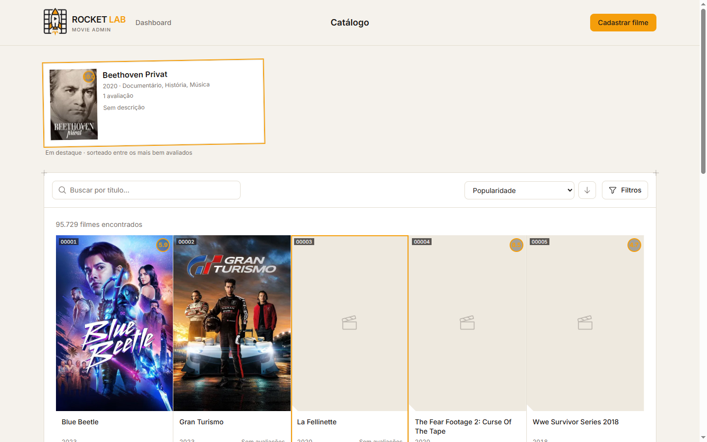
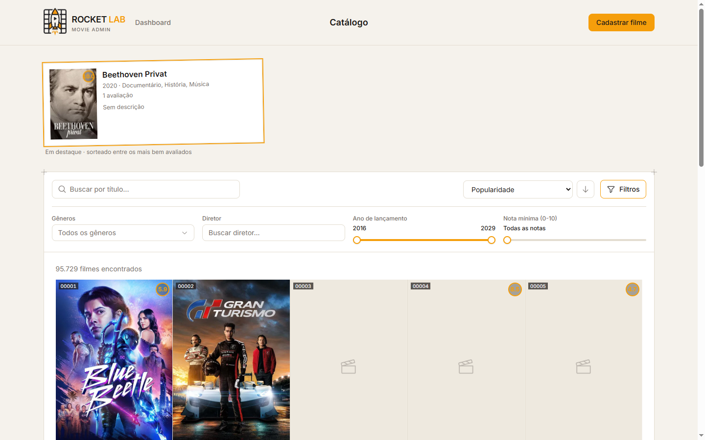
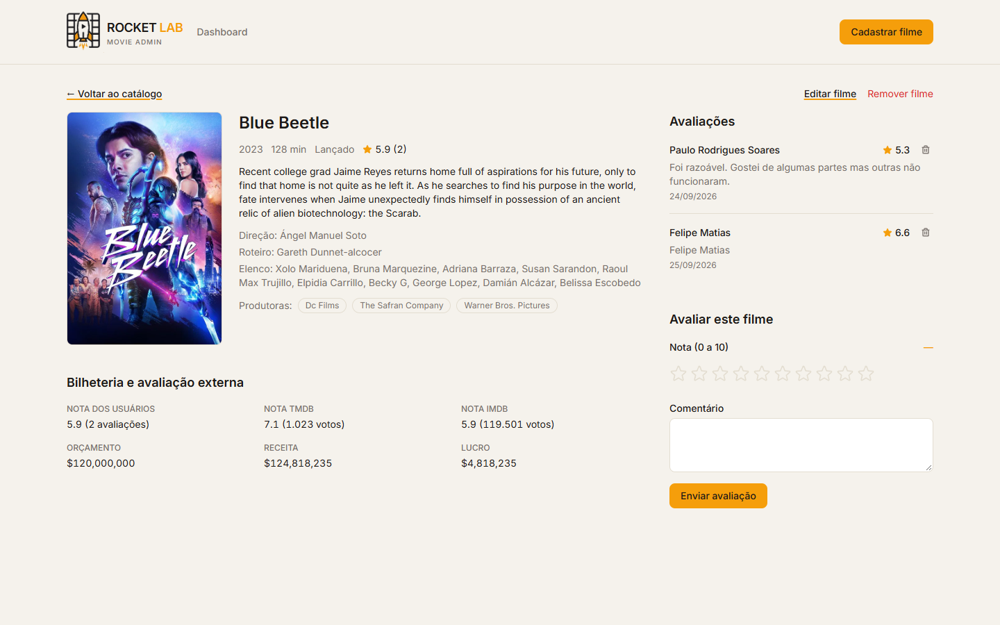
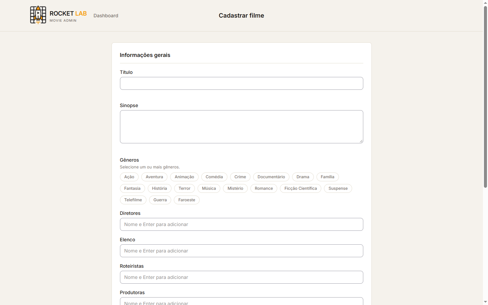
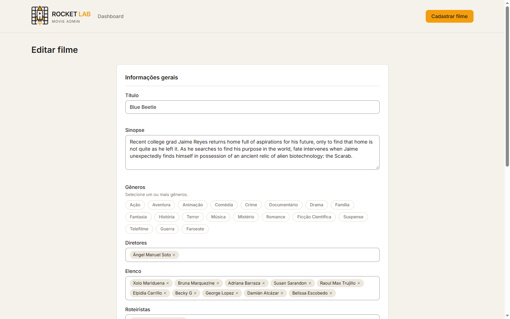
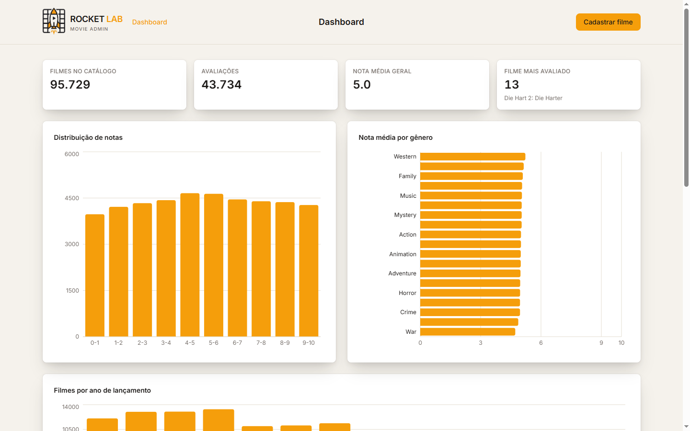
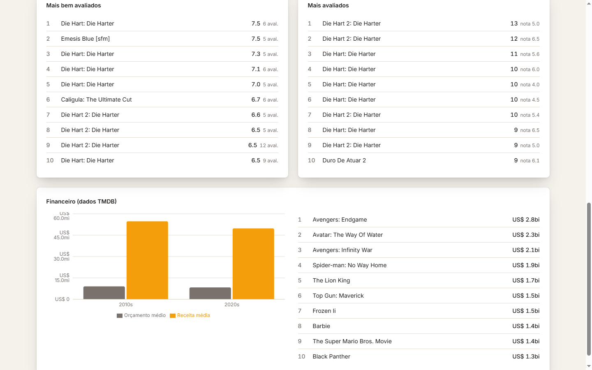

# RocketLab 2026.2 — Sistema de Avaliação de Filmes

Painel administrativo para cadastro, catálogo e avaliação de filmes, inspirado em plataformas
como o Letterboxd, desenvolvido para a atividade DEV do RocketLab 2026.2 (Visagio). O usuário é
um Administrador único: cadastra e gerencia o catálogo, navega numa listagem paginada com busca
e filtros, vê a ficha completa de cada filme com o histórico de avaliações, adiciona/remove notas
e resenhas, e acompanha um dashboard analítico do catálogo inteiro.

**Stack:** Vite + React 19 + TypeScript + Tailwind CSS v4 (frontend), FastAPI assíncrono +
SQLAlchemy 2.0 + Alembic (backend), SQLite. Detalhes de arquitetura e convenções de
desenvolvimento em [`CLAUDE.md`](CLAUDE.md); contexto de produto em [`PRODUCT.md`](PRODUCT.md);
sistema visual em [`DESIGN.md`](DESIGN.md); enunciado original em [`requisitos.md`](requisitos.md).

## Demonstração

Capturas tiradas contra o banco real seedado (95.733 filmes, 43.739 avaliações), não uma base de
exemplo com poucos registros.

### Tour rápido

Catálogo (ordenado por popularidade) → abrir filtros e selecionar um gênero → detalhe de um filme
com elenco/bilheteria/avaliações → dashboard analítico.

<video src="./readme_images/video.mp4" controls width="100%"></video>

### Catálogo: busca, ordenação e filtros

Listagem paginada com pôster, nota e contagem de avaliações; a barra de filtros (gênero, diretor,
faixa de ano e nota mínima) fica escondida atrás do botão "Filtros" para não competir com o
catálogo por padrão.




### Detalhe do filme: elenco completo, bilheteria e avaliações

Ficha com sinopse, direção/roteiro/elenco/produtoras (não só o diretor), nota dos usuários lado a
lado com TMDB/IMDB e dados de bilheteria, histórico de avaliações com remoção individual, e o
formulário de nova avaliação com o slider de 0 a 10.



### Cadastro e edição: elenco/produtoras como tags editáveis

O mesmo formulário serve para criar e editar um filme; diretores, elenco, roteiristas e produtoras
são campos de tags com resolução get-or-create no backend (evita duplicar "Christopher Nolan" e
"christopher nolan" como pessoas diferentes).




### Dashboard analítico

KPIs gerais, distribuição de notas, nota média por gênero, rankings de nota/volume de avaliações e
um recorte financeiro por década a partir dos dados de bilheteria importados do TMDB.




## Funcionalidades

Os 7 requisitos obrigatórios do enunciado:

- Cadastro de filmes (título, diretor, ano, duração, gênero, sinopse, pôster/backdrop) —
  `POST /api/v1/movies`.
- Catálogo paginado — `GET /api/v1/movies`, `CatalogPage`.
- Busca por título (parcial, case-insensitive) — parâmetro `q`.
- Detalhes do filme com histórico de avaliações — `GET /api/v1/movies/{id}`, `MovieDetailPage`.
- Remoção e atualização de filmes — `DELETE`/`PUT /api/v1/movies/{id}`.
- Nova avaliação (nota 0–10 + resenha) — `POST /api/v1/movies/{id}/reviews`. A escala é 0–10, não
  1–5/5 estrelas: o enunciado original menciona "1 a 5 estrelas", mas a equipe do curso
  confirmou 0–10 como escala oficial, já reforçada por um `CheckConstraint` no banco.
- Média geral de avaliações por filme, sempre calculada a partir das avaliações reais (nunca um
  valor digitado à mão).

Funcionalidades além do escopo mínimo, exploradas como parte da "liberdade criativa" do
enunciado:

- Filtros de catálogo por gênero (múltiplo, OR), diretor (autocomplete), ano e faixa de nota, e
  ordenação por título, popularidade, nota (ponderada) ou volume de avaliações.
- Busca, filtros, ordenação e página sincronizados com a URL (`useSearchParams`) — um refresh, o
  botão voltar do navegador ou um link colado reproduzem a mesma visão do catálogo.
- Edição de elenco completo (diretores/atores/roteiristas) e produtoras, com resolução
  get-or-create case-insensitive, não só o diretor.
- Remoção individual de avaliações, recalculando a média ao vivo.
- Dashboard analítico somente leitura (`/dashboard`): KPIs gerais, distribuição de notas, nota
  média por gênero, filmes por ano, rankings de nota/volume de avaliações e um recorte financeiro
  (orçamento/receita por década) a partir dos dados de bilheteria já importados do TMDB.
- Cache de resposta em processo (TTL configurável, 30s por padrão) para catálogo, detalhe de
  filme e dashboard, invalidado a cada escrita.
- Suite de testes automatizados: 39 testes de backend (pytest) e 234 testes de frontend
  (Vitest + Testing Library) em 33 arquivos — ver [Testes](#testes).

Fora do escopo desta entrega, por decisão deliberada (ver [Decisões e histórico](#decisões-e-histórico)):
autenticação, Storybook.

## Como executar

### Pré-requisitos

- Python 3.11+
- Node.js 18+
- Os 10 arquivos `.csv` fornecidos na atividade (dimensões, bridges, fato e avaliações)

### 1. Preparar os dados

Copie os 10 CSVs fornecidos na atividade para `backend/data/seed/csv/` (mantendo os nomes
originais). Detalhes de origem em [`backend/data/seed/README.md`](backend/data/seed/README.md).
Eles não são versionados no Git — o maior deles (`bridge_movie_person.csv`) tem ~93MB / 745 mil
linhas.

### 2. Backend

```bash
cd backend
python -m venv .venv

# ative o ambiente virtual:
source .venv/bin/activate        # Linux/Mac
.venv\Scripts\Activate.ps1       # Windows PowerShell

pip install -e ".[dev]"
cp .env.example .env             # Windows: copy .env.example .env

alembic upgrade head             # cria o schema (nunca use create_all)
python -m scripts.seed           # popula o banco a partir dos CSVs (leva alguns minutos)

uvicorn app.main:app --reload
```

A API sobe em `http://localhost:8000`; documentação automática (Swagger) em
`http://localhost:8000/docs`. `GET /health` confirma que subiu corretamente.

### 3. Frontend

Em outro terminal:

```bash
cd frontend
npm install
cp .env.example .env             # Windows: copy .env.example .env
npm run dev
```

A aplicação sobe em `http://localhost:5173` e já está configurada para falar com o backend em
`http://localhost:8000/api/v1` (`VITE_API_BASE_URL` no `.env`; CORS já liberado no backend só
para essa origem — ver `BACKEND_CORS_ORIGINS` em `backend/.env`).

## Testes

```bash
cd backend && .venv/Scripts/python.exe -m pytest tests/ -q   # 39 testes, pytest
cd frontend && npm run test                                   # 234 testes em 33 arquivos, Vitest
```

Também mantidos e passando nesta revisão: `ruff check app` (backend, 0 problemas),
`npx tsc --noEmit` (frontend, 0 erros) e `npm run lint`/oxlint (frontend, 1 aviso não-bloqueante
de fast-refresh em `Toast.tsx`).

**Isolamento parcial do banco nos testes de backend:** `tests/conftest.py` sobe um SQLite
efêmero, migrado via Alembic, isolado do banco de desenvolvimento — usado por `test_cache.py` e
pelos testes de criação/atualização de filme. Os demais arquivos de teste (`test_list_movies.py`,
`test_movie_detail.py`, `test_delete_movie.py`, `test_delete_review.py`, `test_genres.py`,
`test_sort_by_rating.py`, `test_dashboard_endpoint.py`) ainda batem direto no banco real de
desenvolvimento (`backend/rocketlab.db`). Isso não é um descuido despercebido: o isolamento foi
adicionado depois que rodar a suite antiga contra o banco de dev apagou o elenco de um filme
real durante o desenvolvimento desta funcionalidade — mas a migração dos testes mais antigos
para o fixture isolado ainda não foi concluída. Rode `alembic upgrade head` e
`python -m scripts.seed` antes da primeira execução.

## Estrutura do projeto

```text
.
├── backend/
│   ├── app/
│   │   ├── api/v1/endpoints/   # routers: movies, reviews, genres, directors, dashboard
│   │   ├── core/                # configurações (Settings) e logging
│   │   ├── dashboard/            # service + schemas do endpoint de analytics
│   │   ├── db/                   # Base ORM, engine e sessão async
│   │   └── movies/                # models SQLAlchemy, schemas Pydantic, service.py, cache.py
│   ├── data/seed/                 # onde colocar os CSVs (gitignored, ver data/seed/README.md)
│   ├── migrations/versions/        # 5 migrações Alembic
│   ├── scripts/seed.py             # carga dos CSVs no banco, em lotes
│   └── tests/                      # 39 testes pytest (movies/, dashboard/, cache, models)
└── frontend/
    └── src/
        ├── api/          # cliente HTTP e chamadas tipadas por domínio (movies, dashboard, ...)
        ├── components/   # MovieCard, MovieForm, ReviewForm, FilterBar, dashboard/ (gráficos)...
        ├── pages/         # CatalogPage, MovieDetailPage, CreateMoviePage, EditMoviePage, DashboardPage
        ├── styles/         # tokens de motion, sombra de card, cores de gráfico (sem CSS solto)
        ├── types/          # espelham os schemas Pydantic do backend
        └── utils/          # format, genreLabels, movieTitle, reviewerName + testes
```

## API

Todas as rotas abaixo (exceto `/health`) vivem sob o prefixo `/api/v1`. Schemas completos de
request/response em `http://localhost:8000/docs`.

| Método | Rota | Descrição |
|---|---|---|
| GET | `/health` | Healthcheck simples, fora do prefixo `/api/v1`. |
| GET | `/movies` | Lista paginada, com `q`, `genre_ids`, `director`, `year_from`/`year_to`, `rating_min`/`rating_max`, `sort` (`title`\|`popularity`\|`rating`\|`recent`\|`reviews_count`), `order`. |
| GET | `/movies/{sk_movie_id}` | Detalhe completo: metadados, gêneros, elenco, produtoras, avaliações, resumo de nota, performance (bilheteria). |
| POST | `/movies` | Cria um filme (`genre_ids` deve referenciar gêneros existentes; `diretores`/`atores`/`roteiristas`/`produtoras` são get-or-create). |
| PUT | `/movies/{sk_movie_id}` | Substitui os campos editáveis, incluindo elenco/produtoras por completo (não é merge parcial). |
| DELETE | `/movies/{sk_movie_id}` | Remove o filme; `ON DELETE CASCADE` remove avaliações, vínculos e resumo associados. |
| POST | `/movies/{sk_movie_id}/reviews` | Cria uma avaliação (nome, nota 0–10, comentário); recalcula o resumo de nota do filme. |
| DELETE | `/movies/{sk_movie_id}/reviews/{sk_movie_review_id}` | Remove uma avaliação; recalcula o resumo de nota do filme. |
| GET | `/genres` | Lista todos os gêneros, para popular o formulário de cadastro. |
| GET | `/directors` | Autocomplete de diretores por **prefixo** (`q`, `limit` até 50) — nunca uma listagem completa (ver [Decisões e histórico](#decisões-e-histórico)). |
| GET | `/dashboard` | Payload único e composto: KPIs, distribuição de notas, nota média por gênero, filmes por ano, rankings (nota/volume/receita), financeiro por década. |

## Modelo de dados e banco

O catálogo é modelado como esquema estrela (`backend/app/movies/models.py`): `dim_movies` é a
dimensão de filme; `dim_genres`, `dim_companies` e `dim_people` (ator/diretor/roteirista, um
único tipo por linha via `tipo_pessoa`) são dimensões N:N via tabelas de associação
(`bridge_movie_genre`, `bridge_movie_company`, `bridge_movie_person`) — diretor não é uma coluna
própria em `dim_movies`, é uma linha de `dim_people` filtrada por `tipo_pessoa == "Diretor"`.
`fact_movies_performance` traz métricas de bilheteria/popularidade importadas do CSV (uma linha
por filme). `movie_reviews` guarda cada avaliação individual (nota 0–10, `CheckConstraint`
no banco); `dim_reviews` é o **resumo vivo** por filme (`qtd_avaliacoes_usuarios`,
`nota_media_usuarios`), mantido incrementalmente a cada criação/remoção de avaliação — nunca
recalculado do zero a cada leitura (ver decisão abaixo).

Escala real do banco seedado (consultado diretamente nesta revisão):

- 95.733 filmes, dos quais 87.405 com pôster (~8,7% sem).
- 43.739 avaliações de usuários, cobrindo 40.303 filmes distintos.
- 65.202 diretores distintos, 273.400 atores distintos, 86.056 roteiristas distintos, 45.941
  produtoras — `dim_people` tem 424.658 linhas no total, com nomes frequentemente malformados
  vindos do CSV de origem. É por isso que o filtro/formulário de diretor é sempre um campo de
  busca com limite, nunca um `<select>`/lista completa.
- 19 gêneros.

Migrações (Alembic, `backend/migrations/versions/`, aplicadas com `alembic upgrade head`):

1. `0001_initial_movie_schema` — schema inicial.
2. `0002_add_movie_criado_em` — adiciona `dim_movies.criado_em` para ordenar por "recentes".
3. `0003_dashboard_indexes` — índices usados pelo dashboard (ver decisão de performance abaixo).
4. `0004_dim_reviews_live_summary` — vira `dim_reviews` de snapshot morto do CSV em resumo vivo.
5. `0005_director_autocomplete_prefix_index` — índice composto para o autocomplete de diretor.

**Gotcha do SQLite:** `ALTER TABLE ADD COLUMN` recusa um default não-constante (ex.:
`CURRENT_TIMESTAMP`) via `op.add_column` direto. A migração `0002` usa
`op.batch_alter_table(...)`, que recria a tabela por baixo em vez de rodar o `ALTER` simples.

## Decisões e histórico

Cada entrada abaixo cita o commit/migração de origem — os números vêm de medições reais contra o
banco seedado, registradas nas próprias mensagens de commit no momento da mudança, não
reconstituídas depois.

### Filtro de diretor: de `EXISTS` correlacionado para `IN` não-correlacionado

O filtro usava `DimMovie.people.any(...)`, que o SQLAlchemy compila para um `EXISTS`
correlacionado, reavaliado uma vez por linha de `dim_movies` (~95k). Reescrito como uma subquery
`IN` não-correlacionada, que resolve os diretores batendo com o termo uma única vez e reduz o
filtro a uma busca indexada na tabela de vínculo. Alternativa descartada: manter o `.any()` e
apenas adicionar um índice — não ajuda, porque o problema é a reavaliação por linha, não a falta
de índice. Consequência medida (commit `0c5e059`): a query de contagem caiu de ~8,2s para
~0,045s, e a requisição completa da API para um diretor raro caiu de ~18,6s para ~0,56s.

### Autocomplete de diretor: de busca "contém" para busca por prefixo + índice composto

`nome_pessoa.ilike(...)` compila para `lower(nome_pessoa) LIKE lower(padrão)` no SQLite, o que já
impedia o índice simples em `nome_pessoa` de ser usado mesmo antes desta mudança — uma busca
"contém em qualquer posição" (`%termo%`) sempre varria os ~65 mil diretores após filtrar por
`tipo_pessoa`. Decisão: trocar para busca por prefixo (`termo%`, como a maioria dos autocompletes
já funciona) e adicionar um índice composto `(tipo_pessoa, lower(nome_pessoa))` que só beneficia
esse formato. Alternativa descartada: manter a busca "contém" e só adicionar o índice — não
adianta, o índice não acelera varredura por padrão no meio da string. Consequência medida
(migração `0005`): ~62ms → ~12ms por busca; sem mudança perceptível de comportamento no
catálogo, já que esse filtro é preenchido clicando numa sugestão, nunca digitando um termo livre
até o fim.

### `dim_reviews` como resumo vivo + cache de resposta em processo

`dim_reviews` existia no schema desde o seed inicial (carregada uma única vez do
`dim_reviews.csv` do fornecedor, ~26.605 linhas) mas era código morto: nenhum service a lia, e
`create_review()` nunca a atualizava, então ela ficava dessincronizada de `movie_reviews` (dados
reais de avaliação, ~43,7k linhas) desde a primeira carga. Isso fazia `list_movies()` e o
dashboard recalcularem um `GROUP BY` completo sobre `movie_reviews` a cada chamada — 4 vezes em
sequência só para montar o dashboard. Decisão: a migração `0004` descarta o snapshot do CSV e
recalcula `dim_reviews` uma vez via `INSERT...SELECT...GROUP BY`; daí em diante,
`create_review()`/`delete_review()` mantêm o resumo incrementalmente, restrito ao filme afetado.
Isso viabilizou também um cache de resposta em processo (TTL de 30s, sem dependência nova),
invalidado a cada escrita, para catálogo/detalhe/dashboard. Alternativa descartada: uma fórmula
incremental para reverter a média na remoção de avaliação — descartada em favor de recalcular via
`COUNT`/`AVG` sobre o que sobrou, porque a média zera sozinha quando a última avaliação é
removida, sem caso especial para tratar. Consequência medida (commit `369cf95`): dashboard 1,73s
→ 0,002s e catálogo ordenado por nota 1,05s → 0,002s com cache quente; ~15–25% mais rápido mesmo
em cache miss, só por eliminar o `GROUP BY` completo.

### Índices do dashboard

Medido contra a base real ao construir `GET /api/v1/dashboard`: o ranking de diretores levava
~2,5s (varredura completa de `dim_people`, 424,7k linhas, porque o único índice existente tinha
`tipo_pessoa` como coluna não-líder) e a quebra de nota média por gênero levava ~1,6s (sem índice
persistente em `sk_genre_id`, o SQLite recriava um índice automático a cada chamada). A migração
`0003` adiciona os dois índices que faltavam. Um widget de ranking de diretores foi descartado
depois da medição, não por performance — os dados de "diretor" surgiram obviamente malformados
o suficiente para não valer a pena expor num ranking. Consequência: o endpoint de dashboard caiu
de ~5,2s para ~1,7s.

### Ordenação por nota: média bayesiana em vez da média bruta

`sort=rating` usava a média bruta de `dim_reviews`, o que fazia um filme com uma única avaliação
nota 10 ordenar acima de filmes com centenas de avaliações nota 9. Decisão (commit `fbcaa55`):
o critério de ordenação passa a ser `(qtd×média + m×média_geral) / (qtd+m)`, com `m=3` (votos
imaginários) e a média geral do catálogo calculada na própria consulta SQL — puxa filmes com
poucas avaliações em direção à média geral antes de competir no ranking. A nota/contagem
exibidas continuam sendo os valores brutos; só a ordem muda. Esta é uma decisão de
correção/qualidade percebida, não de performance — não há medição de tempo associada a ela.

### Elenco/produtoras: get-or-create case-insensitive + isolamento de testes

O cadastro/edição de filme resolvia apenas o diretor como get-or-create; generalizado
(`resolve_people`/`resolve_companies`) para diretores, atores, roteiristas e produtoras, todos
case-insensitive por nome — sem isso, variações de capitalização do mesmo nome criariam linhas
duplicadas em `dim_people`/`dim_companies`. Ao construir essa mudança, os testes existentes de
criação/atualização de filme rodavam direto contra o banco real de desenvolvimento
(`backend/rocketlab.db`); uma execução com payload desatualizado durante o próprio
desenvolvimento apagou o elenco de um filme real. Decisão: `tests/conftest.py` passou a subir um
SQLite efêmero migrado via Alembic, isolado do banco de dev, para os testes que precisam de
estado determinístico. Consequência visível: `test_cache.py` e os testes de criação/atualização
de filme já usam o banco isolado; os demais arquivos de teste ainda não foram migrados para lá
(ver [Testes](#testes)) — uma decisão parcialmente aplicada, registrada aqui em vez de descrita
como concluída.

### Escala 0–10 em vez de 1–5 estrelas

O enunciado (`requisitos.md`) menciona "nota de 1 a 5 estrelas", mas a equipe do curso confirmou
0–10 como escala oficial. Decisão: `CheckConstraint(nota >= 0 AND nota <= 10)` direto no banco
(`movie_reviews`), não só validação de UI — uma chamada direta à API não consegue gravar um valor
fora da escala. A alternativa (seguir o enunciado literal, 1–5) foi descartada porque a instrução
mais recente da equipe do curso sobrepõe o texto original do enunciado. Consequência: nenhum
controle de nota no frontend usa convenção de 5 estrelas; o slider de avaliação é um widget de
10 estrelas com preenchimento contínuo, mapeado 1:1 à escala 0–10 (não uma reinterpretação da
escala 1–5).

### Sem autenticação no MVP

Decisão de escopo, não técnica: não há tela de login nem controle de acesso. Alternativa
descartada: implementar autenticação como parte da "liberdade criativa" do enunciado — deixada de
fora deliberadamente porque o enunciado define um único Administrador sem papel de
usuário/visitante, tornando autenticação um adicional sem requisito funcional correspondente
nesta entrega. Consequência visível: qualquer pessoa com acesso à URL do frontend/API atua como
o Administrador.

## Fluxo de trabalho (git)

[Conventional Commits](https://www.conventionalcommits.org/) (`<tipo>: <resumo>`, modo
imperativo) — adotado a partir do commit que introduziu `CLAUDE.md` (`f91b506`), não desde o
início do projeto. Dos 51 commits do histórico, 38 seguem o prefixo de tipo (18 `feat:`, 10
`fix:`, 4 `test:`, 2 `perf:`, 2 `docs:`, 1 `refactor:`, 1 `chore:`); os 13 anteriores a essa
convenção usam mensagens livres. Branch principal: `main`. Escopo (`feat(backend):`,
`fix(frontend):`) só é usado quando desambigua uma mudança que toca os dois lados.

## Escopo

Implementados os 7 requisitos obrigatórios do enunciado (ver [Funcionalidades](#funcionalidades))
mais os itens de "liberdade criativa" listados ali (filtros avançados, ordenação, dashboard
analítico, cache, testes automatizados, edição de elenco completo). Autenticação e Storybook
ficam fora do escopo desta entrega, por decisão deliberada e documentada, não por omissão.

---

Copyright © 2026 Visagio. Todos os direitos reservados.
